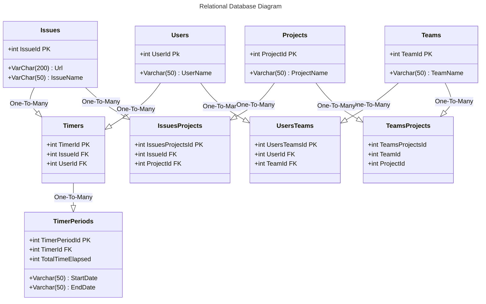

# ITSC SUMMER 2024 - Extension Project

An extension for Github issues that allows users to manage the amount of timer spent on a given issue through a built in timer. Timer data will be written to a unique log comment for the user, and recorded in a sqlite or postgres database on our node.js server. The data is visualized via chart.js and pug pages on the server.



<br><br>
## Non-Relational Database Model:

```json
{
    "timer_id": "12345",
    "user_name": "John Smith",
    "issue": "https://github.com/GrantRynders/Github-Extension-Project/issues/32",
    "issue_name":"Example Issue",
    "timer_periods": [
        {
            "start_date": "Fri Jun 07 2024 08:54:07 GMT-0400 (Eastern Daylight Time)",
            "end_date": "Fri Jun 07 2024 08:54:07 GMT-0400 (Eastern Daylight Time)"
        },

        {
            "start_date": "Fri Jun 07 2024 08:54:07 GMT-0400 (Eastern Daylight Time)",
            "end_date": "Fri Jun 07 2024 08:54:07 GMT-0400 (Eastern Daylight Time)"
        }
    ]
}
```


# Helpful links:
Github issues API: https://docs.github.com/en/rest/issues?apiVersion=2022-11-28

Mozilla extensions documentation: https://extensionworkshop.com/documentation/develop/temporary-installation-in-firefox/

Firefox add extension: about:debugging#/runtime/this-firefox

Github RESTAPI calls in Javascript for personal access tokens: https://docs.github.com/en/rest/guides/scripting-with-the-rest-api-and-javascript?apiVersion=2022-11-28#authenticating-in-github-actions

browser.*, the proposed standard for the extensions API used by Firefox and Safari. Can be used on other platforms with WebExtension browser API Polyfill
chrome.* used by Chrome, Opera, and Edge.

Manifest for chrome: https://developer.chrome.com/docs/extensions/develop/concepts/content-scripts#static-declarative

Chrome refresh background scripts: https://github.com/orgs/community/discussions/61228

Web storage example: https://github.com/mdn/dom-examples/tree/main/web-storage

Prisma SQLite quickstart: https://www.prisma.io/docs/getting-started/quickstart

Prisma PostgreSQL guide: https://www.prisma.io/docs/getting-started/setup-prisma/start-from-scratch/relational-databases-typescript-postgresql

Prisma video: https://youtu.be/J8ObGtfy5n0?si=Lq463OEyFXGa6Lb0

Bar chart: https://www.chartjs.org/docs/latest/charts/bar.html
