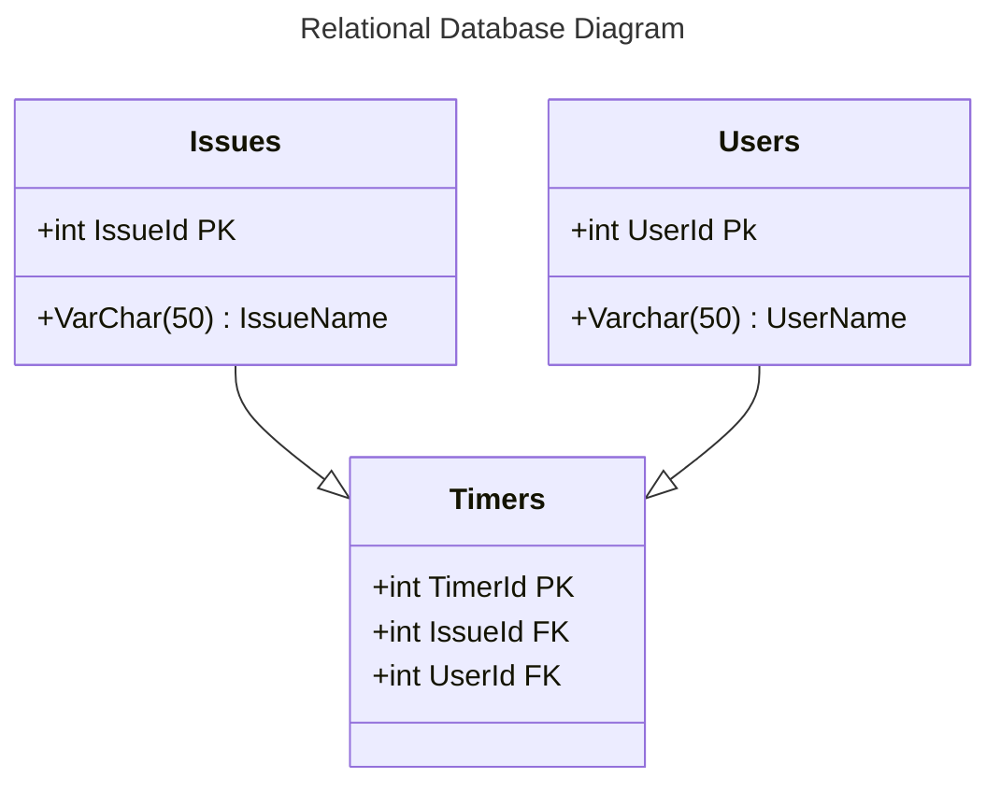

# ITSC SUMMER 2024 - Extension Project

An extension for Github issues that allows users to manage the amount of timer spent on a given issue through a built in timer. Timer data will be written to the description of the issue, for easy tracking.
</img>

Non-Relational Database Model
"timer_id": "12345",
"user_name": "John Smith",
"dates" [
    {
        "start_date": "Fri Jun 07 2024 08:54:07 GMT-0400 (Eastern Daylight Time)",
        "end_date": "Fri Jun 07 2024 08:54:07 GMT-0400 (Eastern Daylight Time)"
    },
    {
        "start_date": "Fri Jun 07 2024 08:54:07 GMT-0400 (Eastern Daylight Time)",
        "end_date": "Fri Jun 07 2024 08:54:07 GMT-0400 (Eastern Daylight Time)"
    }
]

# Helpful links:
Github issues API: https://docs.github.com/en/rest/issues?apiVersion=2022-11-28

Mozilla extensions documentation: https://extensionworkshop.com/documentation/develop/temporary-installation-in-firefox/

Firefox add extension: about:debugging#/runtime/this-firefox

Github RESTAPI calls in Javascript for personal access tokens: https://docs.github.com/en/rest/guides/scripting-with-the-rest-api-and-javascript?apiVersion=2022-11-28#authenticating-in-github-actions

browser.*, the proposed standard for the extensions API used by Firefox and Safari. Can be used on other platforms with WebExtension browser API Polyfill
chrome.* used by Chrome, Opera, and Edge.

Manifest for chrome: https://developer.chrome.com/docs/extensions/develop/concepts/content-scripts#static-declarative

Chrome refresh background scripts: https://github.com/orgs/community/discussions/61228

Web storage example: https://github.com/mdn/dom-examples/tree/main/web-storage

