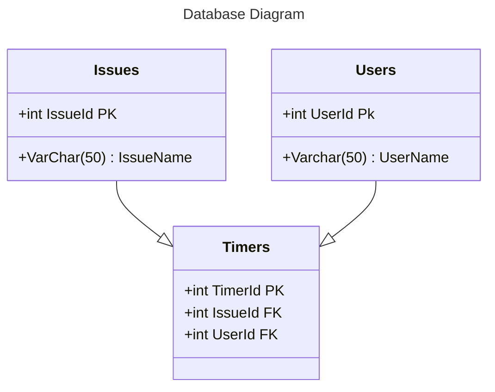

An extension for Github issues that allows users to manage the amount of timer spent on a given issue through a built in timer. Timer data will be written to the description of the issue, for easy tracking.

